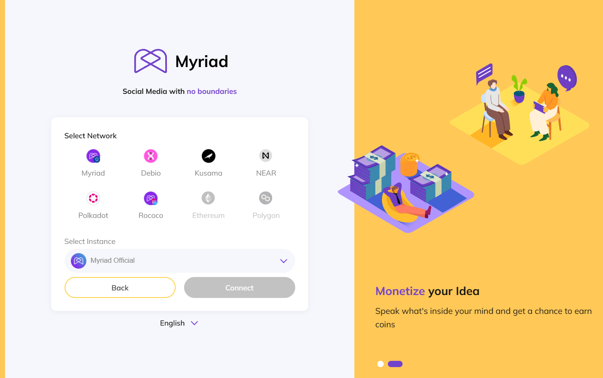
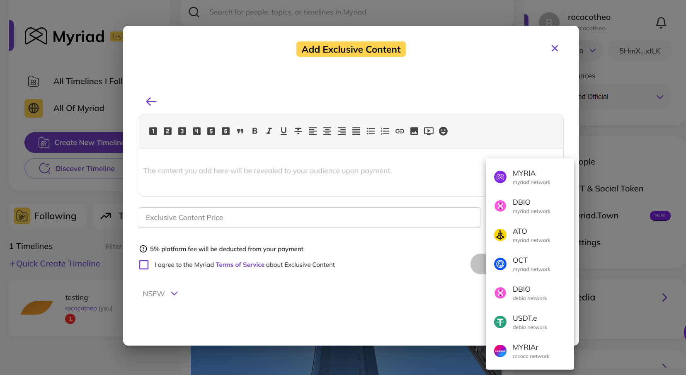
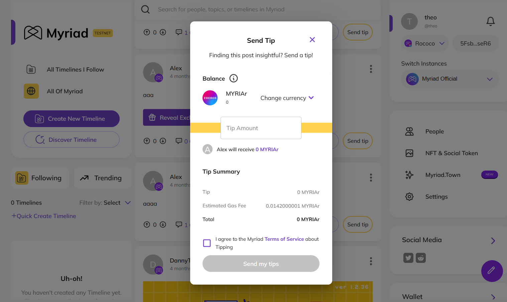

# Documentation

Myriad Social is a Web3 Social Media that functions as a layer on top of regular social media. Until very recently, Myriad Social was built on top of Octopus Network relying on the underlying infrastructure of its blockchain technology. Myriad Social was always a multichain application, but it's limited to both Octopus Network and NEAR blockchain.

We've released a new version of Myriad Social, which is now built on the Polkadot Test network, Rococo. The transition to Rococo, represents a significant advancement for Myriad Social, as it allows for greater scalability and interoperability.

## 1. Adding New Wallet Integrations for Rococo

With the transition to Rococo, Myriad Social is adding new wallet integrations to enhance user experience and broaden accessibility. Users can now do Crypto Wallet authentication from the Myriad Social Rococo Substrate blockchain. 

This enables users to have a seamless and secure experience within the Myriad Social platform, as they can easily make transactions, and engage with other users via tipping without leaving the platform.

## 2. Allow Tipping and Exclusive Content Pricing Using $MYRIA on Rococo Testnet

With the addition of a Myriad Social Rococo wallet integration it is easier to integrate the new chain to the already existing content tipping and exclusive content already available in the platform.

Exclusive content can now be priced in $MYRIAr a currency that is native to the new Myriad Social Rococo blockchain. 

Tipping is also available in this new native currency, users can follow the existing tipping flow and they will see a new currency to tip with if they connect using the new Rococo wallet integration.

This upgrade will not only enhance the user experience but also open up new possibilities for developing for a broader multi-chain ecosystem integrated social media platform.
