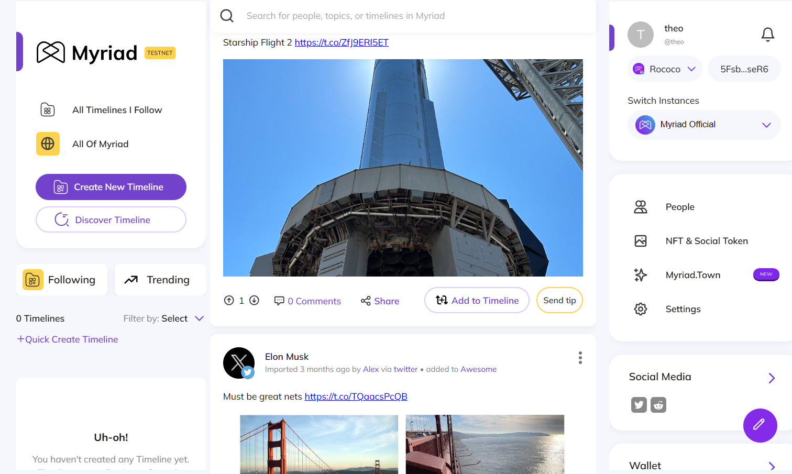
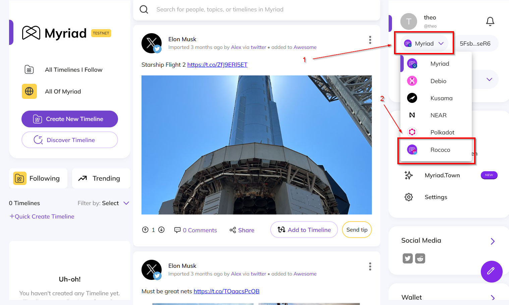
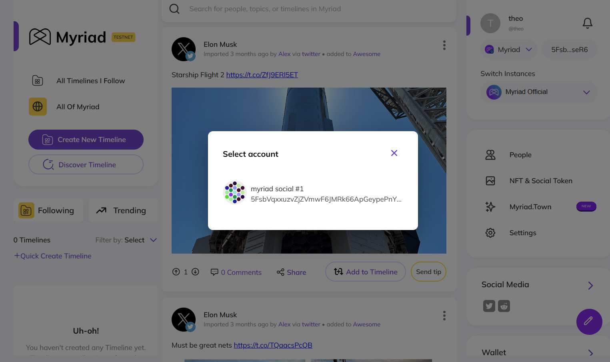
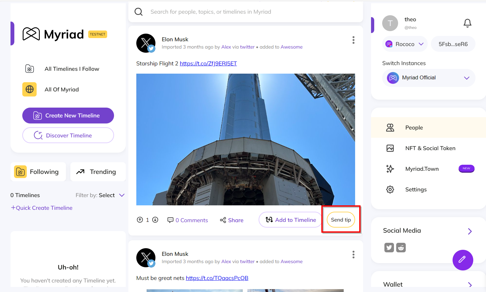
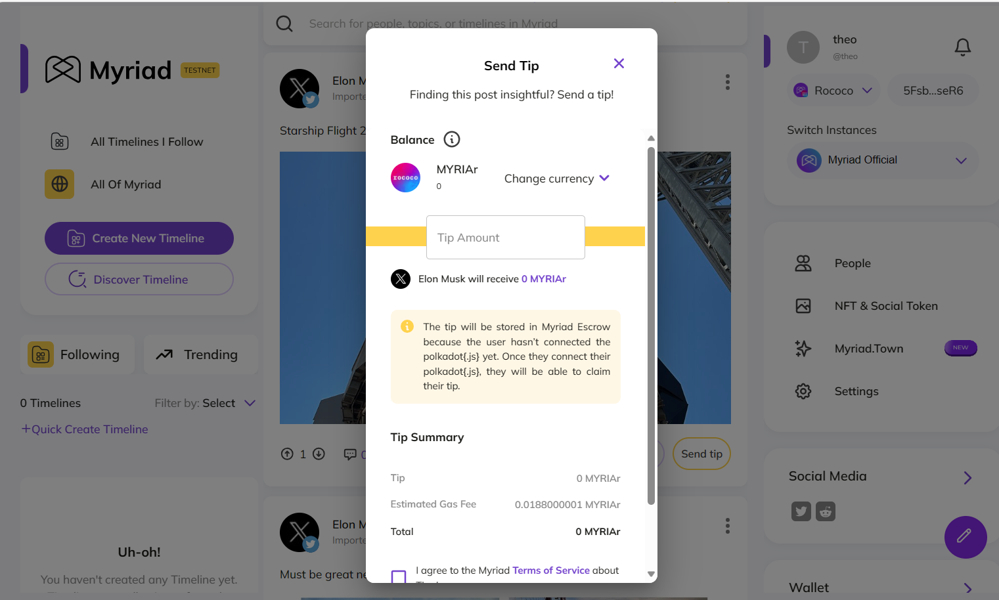
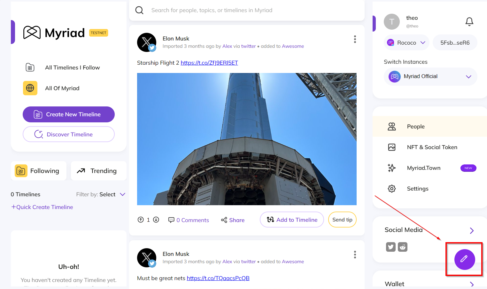
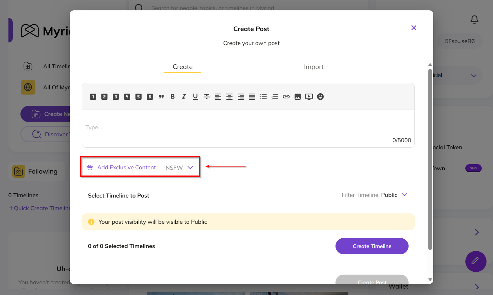
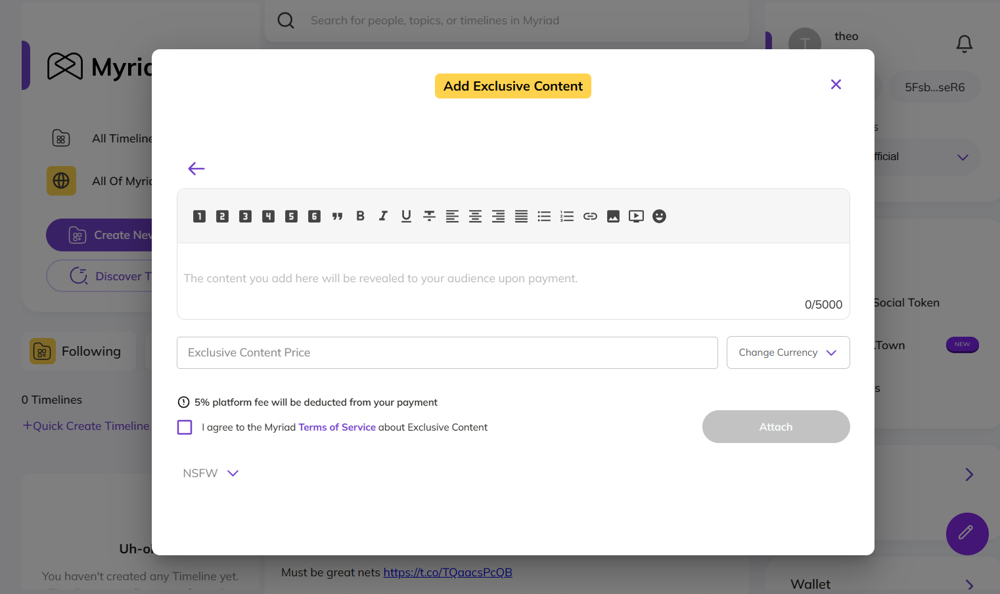

# Testing Guide

To test the current additions in the second milestone you would need to access the current [Myriad Social Testnet](https://app.testnet.myriad.social).

## Prerequisites

If you've haven't used Myriad Social before to test the new features you would need to:

1. Install Polkadot.js in your browser.
2. Generate a new seed-phrase specifically to make a new Myriad Social Account.
3. Open the [Myriad Social Testnet login page](https://app.testnet.myriad.social/login?instance=https%3A%2F%2Fapi.testnet.myriad.social) and authenticate with the Myriad Social Devnet using the Crypto Wallet feature.

> Because of unforeseen circumstances you are unable to test in the Rococo testnet just yet, the Myriad Social team is still working on releasing the Myriad Social Rococo blockchain as a Rococo Parachain.

## 1. Testing Myriad Social Wallet Integration

The wallet integration focuses on two functionalities authentication and moving chains. In a multi-chain ecosystem users will need to be able to change the chain they are on seamlessly. 

### 1.1. Login Using Myriad Social Rococo

To test the login feature, create a new seed-phrase and open the [Myriad Social Testnet login page](https://app.testnet.myriad.social/login?instance=https%3A%2F%2Fapi.testnet.myriad.social).

Choose the **"Rococo"** option and click, **Connect**.

If all is well, you will be redirected to the homepage.

### 1.2. Moving Chains to Myriad Social Rococo

In Myriad Social, moving from chain-to-chain will be seamless. You can move from Substrate chains such as Myriad Social on Octopus, Debio network, Kusama, and now Rococo. You can also choose to move to a non-Substrate chain like NEAR Protocol.

Assuming that you have a Myriad Social Octopus connection move to Rococo by clicking the icon on the top-right.

Click on the **"Rococo"** option and choose the wallet you want to use.

> If you're already on Rococo testnet then try moving around in different chains. That way you can test if you can seamlessly move in-and-out of the Rococo testnet.

## 2. Testing Myriad Social Tipping and Exclusive Content Integration

Tipping and exclusive content is an essential feature in Myriad Social.

### 2.1. Testing Tipping

Out of the two features, tipping in Myriad Social is the most important, because with tipping you can tip users who are not even on Myriad Social yet!

In this example, we're going to tip Elon Musk. Someone imported an Elon Musk tweet and all we need to do is to click on the **Send Tip** button.

Afterward, select your currency and enter the amount, before sending.

> If you didn't find the MYRIAr token (Myriad Social Rococo native token) then you need to switch to the Rococo chain first.

### 2.2. Testing Exclusive Content

Exclusive content will only be shown to people who pay to view. The pricing of each content can be set using specific currencies.

To test this out create a new post.

Click on the **Add Exclusive Content** button on the bottom-left of the modal.

And you will receive a new modal to set the amount and choose the exact currency you want to use.

