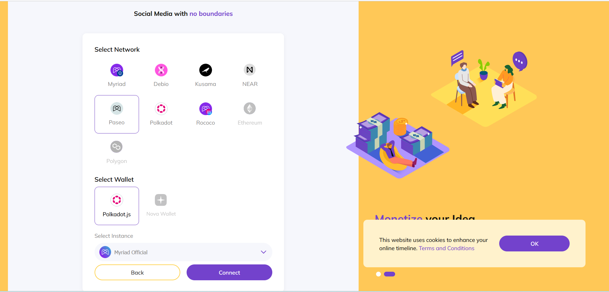
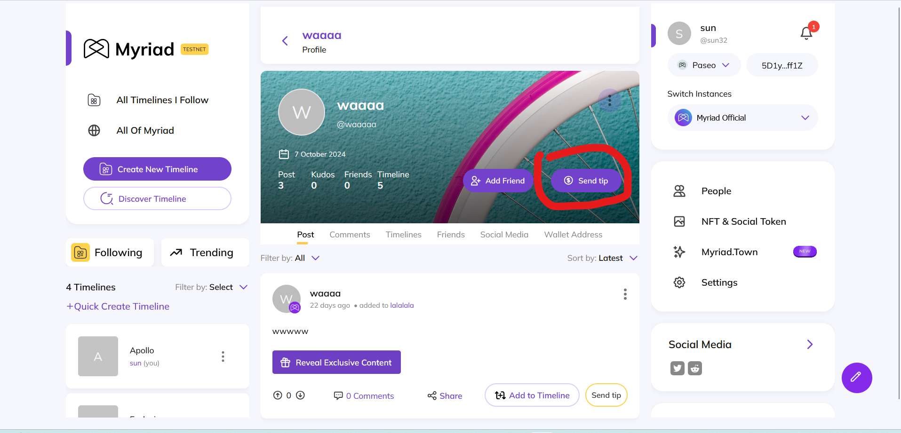
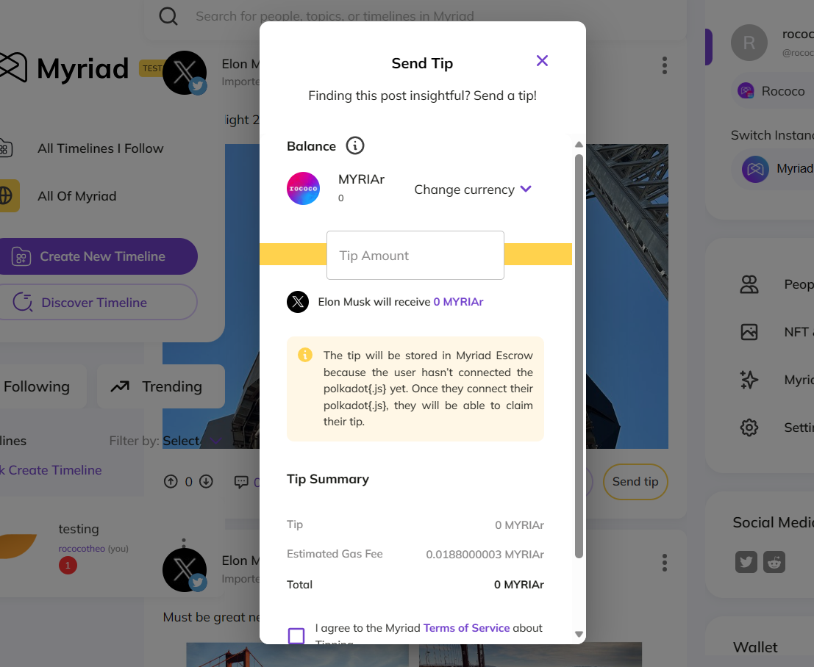
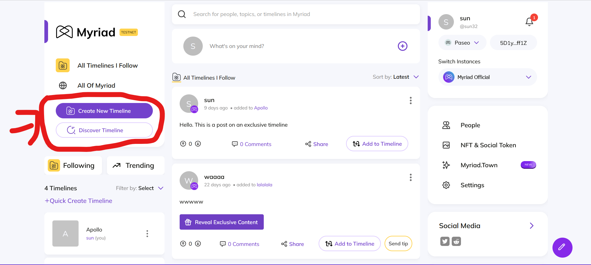

# Documentation

Myriad Social is a Web3 Social Media platform that functions as a layer on top of regular social media. Initially built on top of Octopus Network, Myriad Social has now expanded to support multiple blockchain networks, including Octopus Network and NEAR blockchain.

In our latest milestone, we have introduced a refreshed user interface aimed at enhancing the overall user experience and simplifying platform interactions. This update brings streamlined functionalities, intuitive navigation, and comprehensive guides to assist both new and existing users.

## 1. Polkadot Setup, Connection, and User Guide

We have revamped the Polkadot wallet integration process to make it more user-friendly. A step-by-step guide with interactive tooltips now assists you through every stage of connecting your Polkadot wallet.

The new Polkadot setup and connection process offers several enhancements. It includes **interactive tooltips** that provide real-time assistance when hovering over elements during the setup. Additionally, the **simplified connection flow** reduces the number of steps and offers clearer instructions, ensuring you can connect your wallet seamlessly. Furthermore, enhanced visuals with intuitive graphics guide you through the entire process, making the experience more user-friendly and visually appealing.

## 2. Simplified Transaction Flow for Tipping and Exclusive Content

We have streamlined the transaction processes for tipping creators and accessing exclusive content, ensuring a smoother experience.

The new **Tipping Enhancements** bring a more seamless and transparent experience for users. With a **unified interface**, the tipping window is now consolidated and easy to navigate, simplifying the process. **Quick access buttons** allow users to tip creators directly from their posts without the need for extra navigation, making support instant and effortless. Moreover, **transparent fees** ensure that any transaction costs are clearly displayed before confirming a tip, fostering trust and clarity in every transaction.

## 3. Simplified Timeline Discovery and First Step Guide for New Users

Discovering new timelines and managing your own is now more intuitive thanks to a revamped layout and enhanced search capabilities, allowing users to discover new timeline based on tags user want to see or dont want to see.

The first step for user is to click the create timeline button that redirects user to our multi staged timeline creation interface designed to prevent information overload to user while still allowing user to have more granular control over their timeline.

The new user onboarding guide includes Step-by-Step Tooltips, which provide contextual tips as you navigate through the platform, and an Onboarding Checklist that allows you to keep track of your progress with a list of introductory tasks. These features work together to ensure a smooth and comprehensive onboarding experience, helping you become familiar with the platform efficiently and effectively.

### Exclusive Timeline

We have introduced the Exclusive Timeline feature, which allows you to mark specific timeline content as exclusive. Here's how to create one:

1. Click the "Create New Timeline" button in the left sidebar to start creating a new timeline

2. In the creation form, you'll find an "Exclusive" toggle switch that lets you mark your timeline as exclusive content

3. After filling in your timeline details, click the "Next" button to proceed with creating your exclusive timeline

Your timeline name can be between 1-50 characters, and you can optionally add a description (up to 280 characters). You can also set the privacy level (Public, Private, etc.) and customize the timeline picture.

When a timeline is marked as exclusive, it will be clearly indicated with an exclusive label, helping differentiate it from regular timelines in the listing.

## 4. B2B Features: Multi-User Management System

We have implemented comprehensive B2B features that enable organizations to manage multiple users, timelines, and content metrics efficiently through a single interface. This enterprise-grade functionality provides organizations with powerful tools for team collaboration and content management.

### Account Sharing System

The new account sharing system introduces a secure way to manage multiple user access:

- **Personal Access Tokens (PAT)**: Generate secure tokens for controlled account access
- **One-Time Token Display**: Enhanced security with tokens shown only once during generation
- **Seamless Authentication**: Quick login process using generated tokens

### Multi-User Capabilities

Our B2B implementation offers essential features for team management, including timeline collaboration for shared contributions, a content metrics dashboard to track engagement and performance, and access level management to control user permissions. Designed with a focus on security and usability, this multi-user system empowers businesses and organizations to strengthen their social media presence while maintaining control over their digital assets.

### Video Tutorial: Multi-User System

## 5. Mobile Wallet Integration with Nova Wallet

We are excited to announce that Myriad Social now supports mobile wallet integration with Nova Wallet. Previously, mobile users were limited to connecting via NEAR Wallet, but with this update, you can now connect your Polkadot wallet seamlessly on mobile devices.

### Video Tutorial: Nova Wallet Integration

The mobile wallet integration with Nova Wallet offers the following benefits:

- **Polkadot Wallet Support on Mobile**: Easily connect your Polkadot wallet using Nova Wallet on your mobile device.
- **Streamlined Authentication**: Enjoy a seamless login experience with enhanced security.
- **Cross-Platform Compatibility**: Access your account across multiple devices without any hassles.

### Getting Started with Nova Wallet Integration

To connect your Polkadot wallet on mobile, follow these steps:

1. **Download Nova Wallet**: Ensure you have the Nova Wallet app installed on your mobile device.
2. **Navigate to Myriad Social**: Open Myriad Social on your mobile browser.
3. **Connect Wallet**: Click on the wallet icon and select "Connect with Polkadot Wallet".
4. **Authorize Connection**: Follow the prompts in Nova Wallet to authorize the connection.
5. **Start Exploring**: Once connected, you can start interacting with the Myriad Social platform.

## 6. Backend Improvements and Algorithm Enhancements

We have significantly enhanced our backend infrastructure and algorithms to improve content discovery, platform performance, and user experience. Users can now seamlessly import and embed [YouTube content](https://github.com/myriadsocial/myriad-api/pull/976) with native playback support, automatic metadata extraction, and optimized performance, while our refined content ranking algorithm focuses on the most recent 12 months of data to ensure fresh content, phasing out historical posts while still maintaining archive access. Enhanced ranking factors now include post engagement metrics, timeline trends, hashtag usage, user interactions, and content quality signals.

### Video Tutorial: Update Filtering

## 

We are excited for you to experience these new features and improvements. Your feedback is invaluable to us, so please do not hesitate to share your thoughts and suggestions.

**Host your own decentralized social network!**
