# Testing Guide

To test the current additions in the third milestone, you need to access Myriad Social on the Paseo Network, where we are now live as a Parachain with ParaID 4005.

<div align="center">

</div>

## Prerequisites

If you haven't used Myriad Social before, you'll need to:

1. Install Polkadot.js or Nova Wallet (for mobile users)
2. Generate a new seed-phrase for your Myriad Social Account
3. Connect to our RPC endpoint: `wss://ws-rpc.paseo.myriad.social`

[](https://polkadot.js.org/apps/?rpc=wss%3A%2F%2Fws-rpc.paseo.myriad.social)

## 1. Testing Polkadot Wallet Integration

The new wallet integration now features an enhanced user interface with interactive tooltips to guide you through the connection process.

### 1.1. Desktop Login Using Polkadot.js

1. Visit the Myriad Social login page
2. Look for interactive tooltips that will guide you through each step
3. Select "Connect with Polkadot Wallet"
4. Follow the simplified connection flow to complete authentication

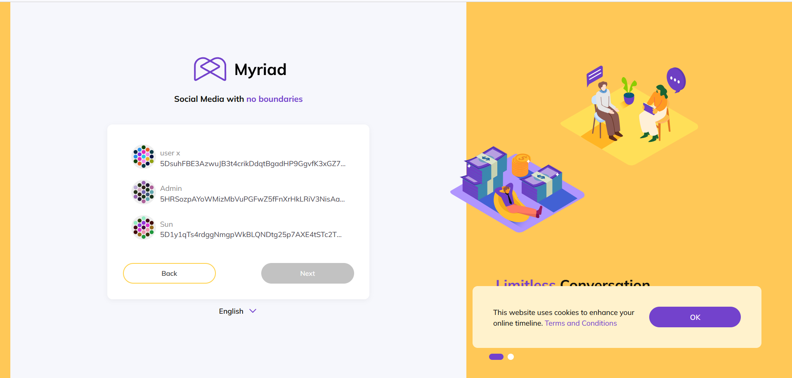
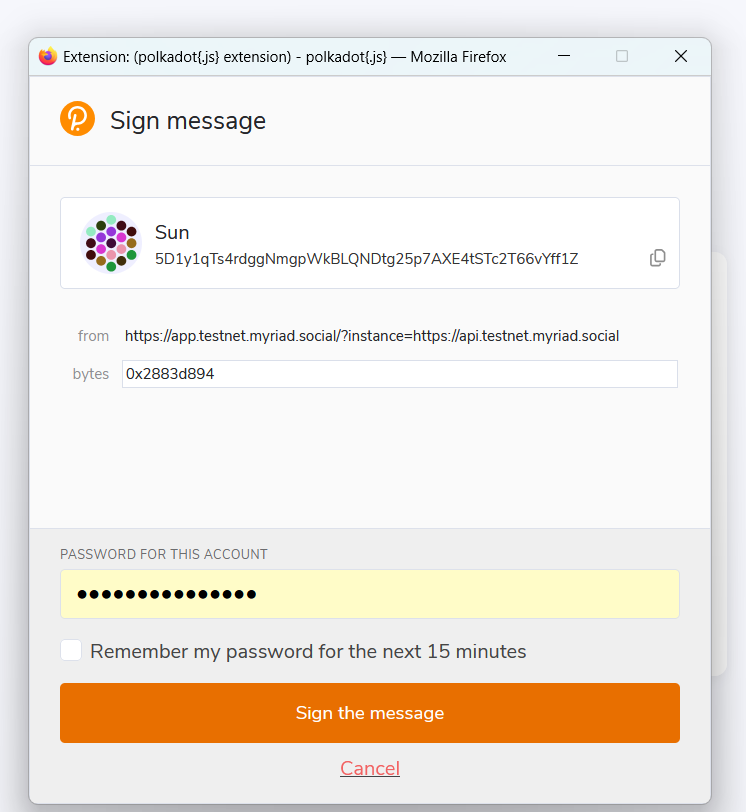

### 1.2. Mobile Login Using Nova Wallet

1. Install Nova Wallet on your mobile device
2. Open Myriad Social in your mobile browser
3. Click on the wallet icon and select "Connect with Polkadot Wallet"
4. Follow the prompts in Nova Wallet to authorize the connection

#### Video Tutorial: Nova Wallet Integration
[](https://www.youtube.com/watch?v=6PtEhR9-K50)

## 2. Testing Timeline Features

### 2.1. Creating Regular Timeline

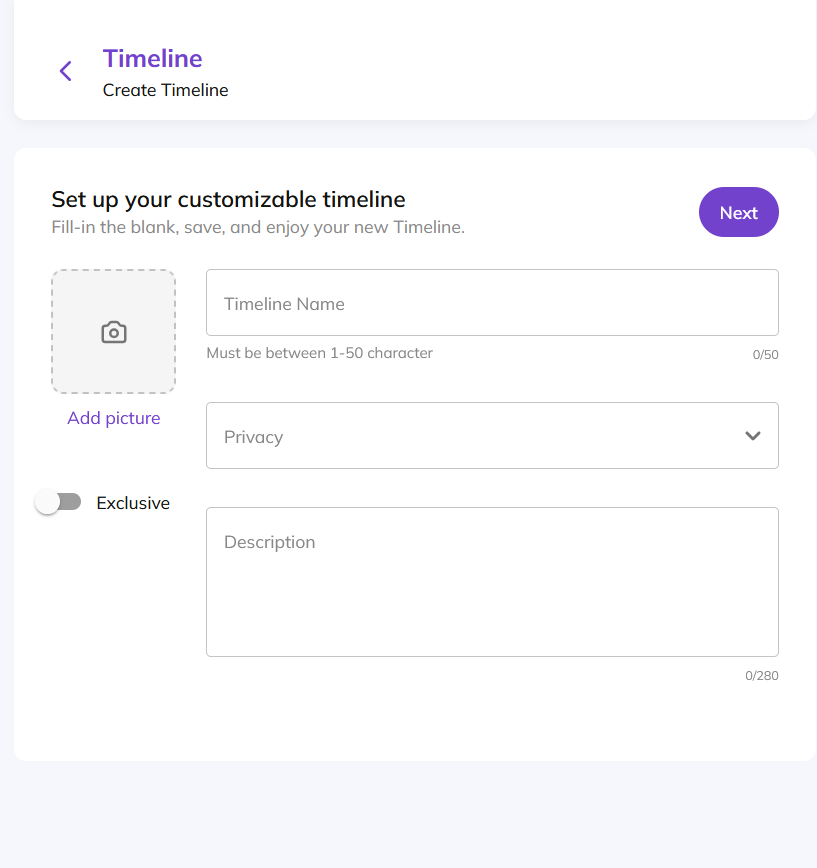
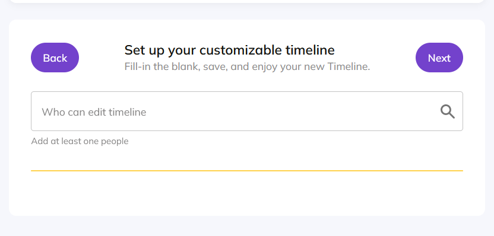
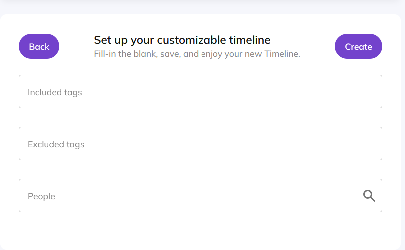

1. Click the "Create New Timeline" button in the left sidebar
2. Fill in your timeline details:
   - Name (1-50 characters)
   - Description (up to 280 characters, optional)
   - Privacy settings
   - Timeline picture (optional)
3. Use the multi-staged interface to complete the setup

### 2.2. Creating Exclusive Timeline

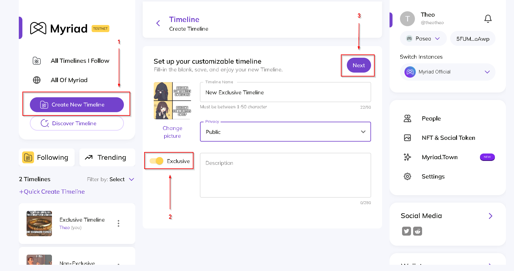

1. Click "Create New Timeline"
2. Toggle the "Exclusive" switch to mark the timeline as exclusive
3. Complete the timeline details as above
4. The timeline will display an exclusive label when created

### 2.3. Timeline Discovery


Test the new discovery features:
1. Use the enhanced search capabilities
2. Filter timelines based on tags
3. Explore the "don't want to see" filtering options

## 3. Testing B2B Features

### 3.1. Account Sharing System

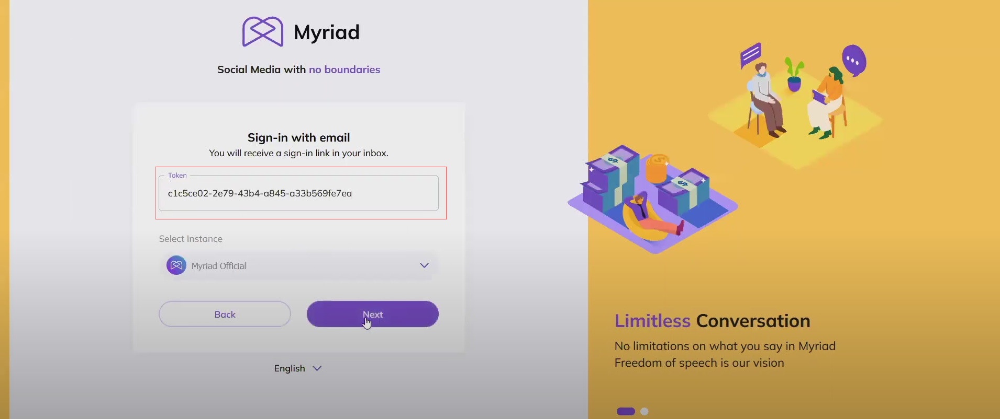

1. Generate a Personal Access Token (PAT):
   - Navigate to account settings
   - Generate a new token
   - Save the token immediately (it's shown only once)

### 3.2. Multi-User Management

Test the following features:
1. Timeline collaboration
2. Content metrics dashboard
3. Access level management
4. Team member permissions

#### Video Tutorial: Multi-User System

[](https://www.youtube.com/watch?v=-cf-RXFiCdM)

## 4. Testing Enhanced Transaction Features

### 4.1. Tipping System

#### 4.1.1 Tipping User Posts

The tipping system allows users to show appreciation for content through monetary tips. Here's how to send a tip:

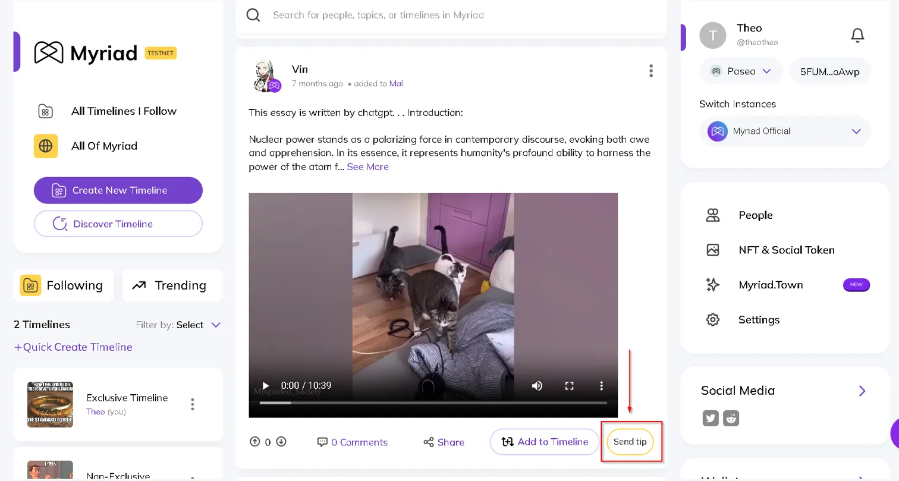

1. Initiate the tip:
   - Locate the "Send tip" button on any post
   - Click the button to open the tipping interface

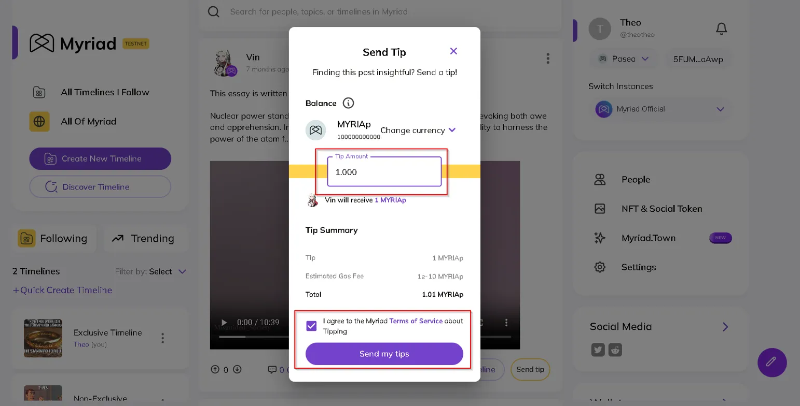

2. Configure your tip:
   - Choose your preferred currency (e.g., MYRIAp)
   - Enter the tip amount
   - Review the transaction summary, including:
     - Tip amount
     - Estimated gas fee
     - Total transaction cost
   - Accept the Myriad Terms of Service for tipping

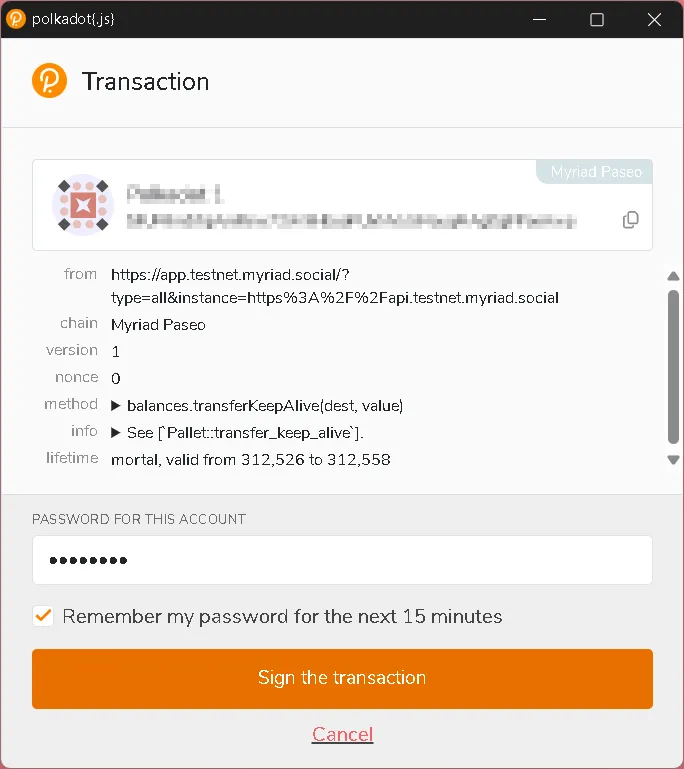

3. Sign the transaction:
   - A PolkadotJS wallet window will appear
   - Review the transaction details
   - Enter your wallet password
   - Click "Sign the transaction" to confirm

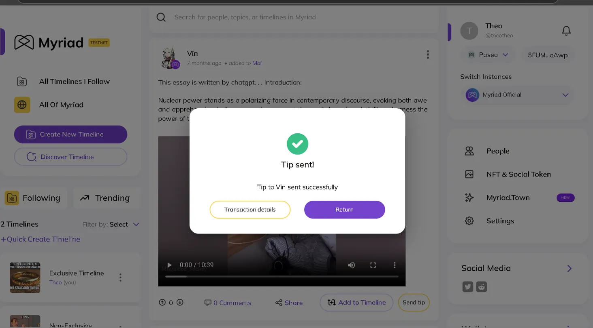

4. Confirmation:
   - Wait for transaction processing
   - A success message will appear when completed
   - You can view transaction details or return to browsing

Features:
- Multiple currency support
- Transparent fee display
- Transaction verification
- Immediate confirmation
- Automatic recipient crediting

> Note: Ensure you have sufficient balance in your wallet to cover both the tip amount and gas fees.

#### 4.1.1 Tipping Users Directly

To send tips directly from someone's profile:

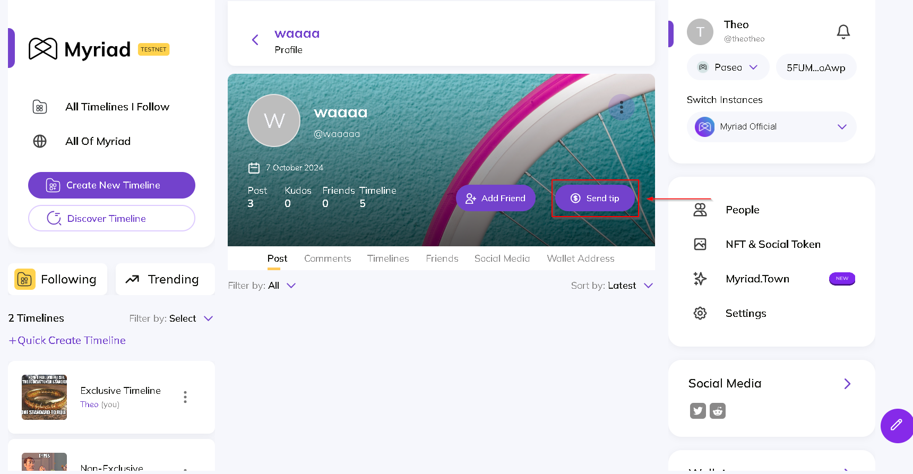

1. Look for the "Send Tip" button on their profile and click it.

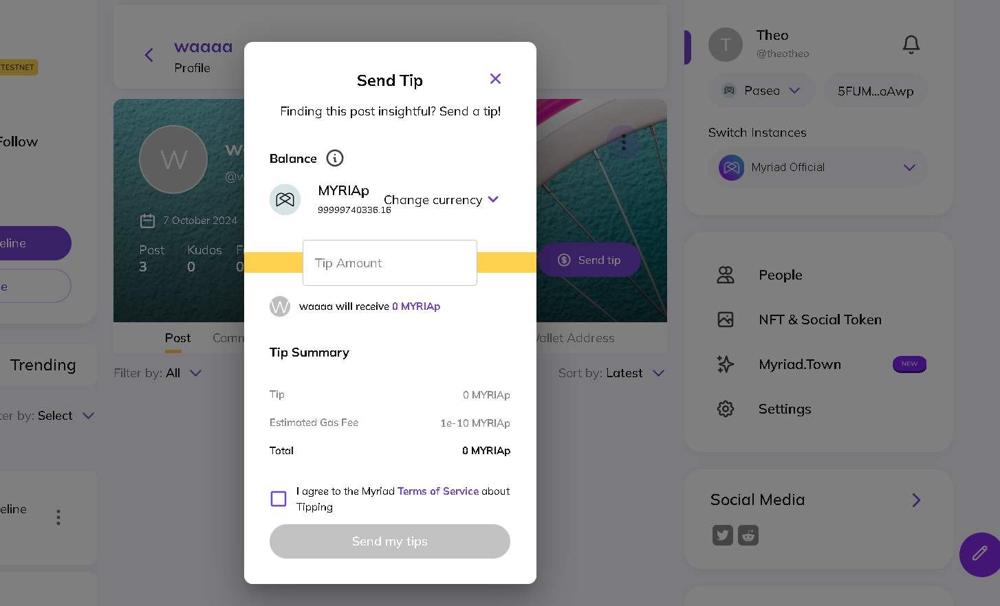

2. A window will open where you can send your tip through the familiar tipping process.

### 4.2. Exclusive Content Creation and Access

Creating exclusive content involves several steps:

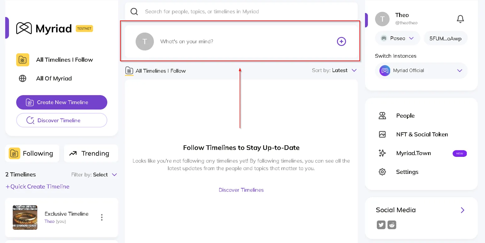

1. Start a new post:
   - Click the "What's on your mind?" text box
   - This will open the post creation popup

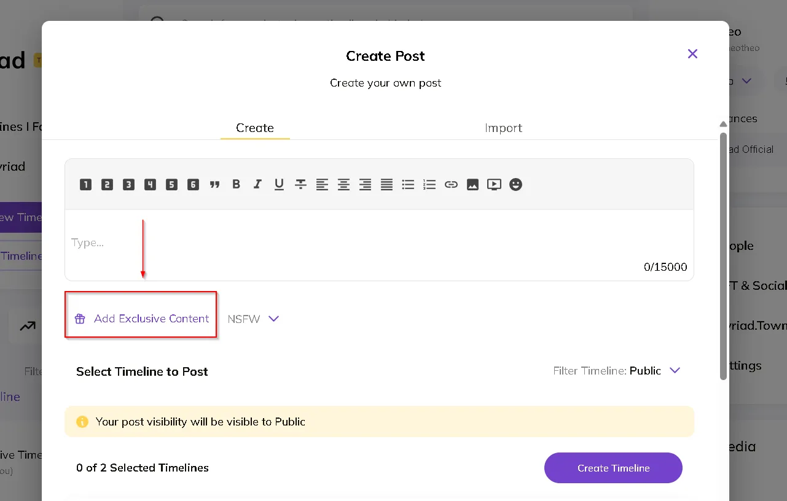

2. Add exclusive content:
   - Look for the "Add Exclusive Content" button below the main post editor
   - Click to open the exclusive content section

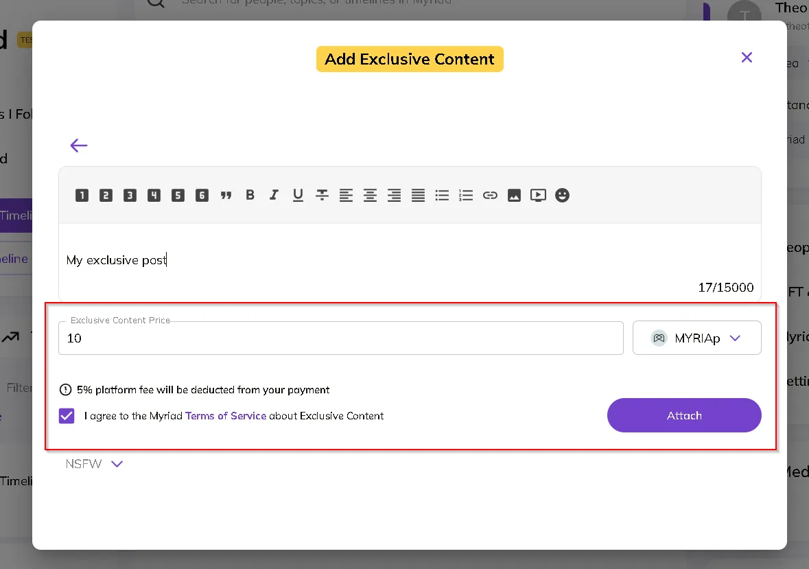

3. Configure your exclusive content:
   - Write your exclusive content (separate from the main post)
   - Set the price in your preferred currency (e.g., MYRIAp)
   - Note the 5% platform fee disclosure
   - Accept the Myriad Terms of Service for exclusive content
   - Click "Attach" to add the exclusive content to your post

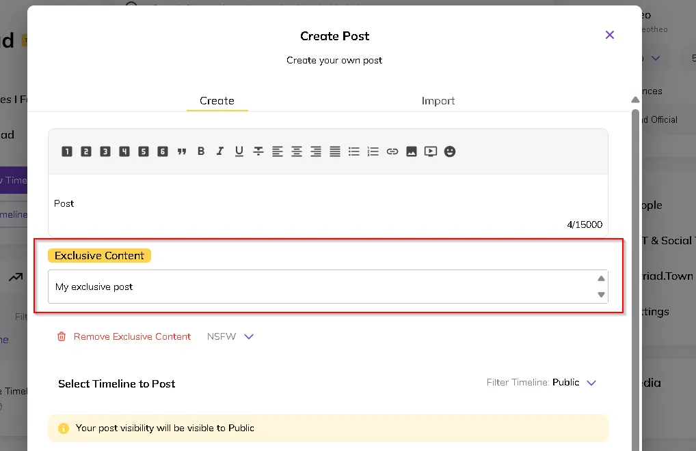
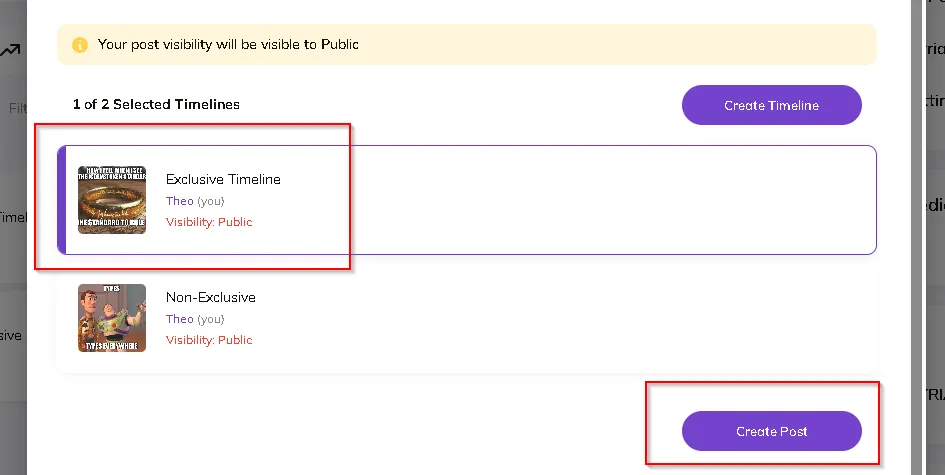

4. Complete the post:
   - Add your main post content (visible to all users)
   - Select a timeline for posting (can be regular or exclusive timeline)
   - Verify your post visibility settings
   - Click "Create Post" to publish


5. Accessing exclusive content (as a viewer):
   - Locate a post with exclusive content
   - Click the "Reveal Exclusive Content" button
   - Pay the required amount to access the content
   - View the exclusive content within the post

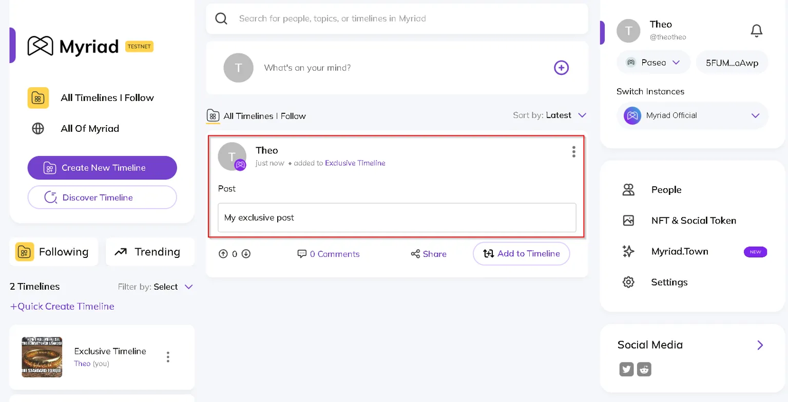

> Note: The main post content and exclusive content are separate - the main post is visible to everyone, while the exclusive content is only accessible to users who pay for access.

## 5. Testing Self-Hosting Capabilities

If testing the self-hosted version:

### 5.1. System Requirements
- Ubuntu 22.04 or later
- Minimum 4GB RAM
- 20GB available storage
- Sudo privileges
- Stable internet connection

### 5.2. Quick Setup
```bash
wget --no-cache https://raw.githubusercontent.com/myriadsocial/myriad-web/main/marauder.sh
chmod +x marauder.sh
./marauder.sh
```

### 5.3. Service Management
```bash
# Start service
sudo systemctl start myriad-social.service

# Check status
sudo systemctl status myriad-social.service

# View logs
sudo journalctl -u myriad-social.service
```

# Automated Tests

There are two ways to run automated tests for the new features:

## Option 1: Build Using Dockerfile

You can build and run the test environment using our provided Dockerfile:

1. Clone the repository: 
   ```bash
   git clone https://github.com/myriadsocial/myriad-infrastructure.git
   ```
2. Navigate to the directory:
   ```bash
   cd myriad-infrastructure/linux
   ```
3. Build the Docker image:
   ```bash
   docker build -t myriad-test .
   ```
4. Run the container:
   ```bash
   docker run -it --name myriad-test-container myriad-test
   ```

The Dockerfile is available at: https://github.com/myriadsocial/myriad-infrastructure/blob/main/linux/Dockerfile

## Option 2: Use the Pre-built Container

Alternatively, you can use our pre-built test container:

```bash
docker run -it --name marauder-container \
--network host \
-v /var/run/docker.sock:/var/run/docker.sock \
agustinustheoo/marauder-test:latest
```

Note: All features connect directly to the blockchain on the Paseo Network. For detailed API testing guidelines, refer to the Myriad Parachain repository.